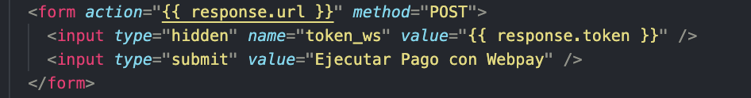
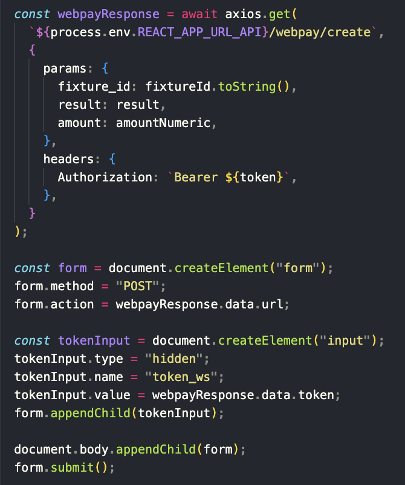

# README para Proyecto IIC2173

## Consideraciones Generales
Se realizó el proyecto en un servidor EC2 de AWS, utilizando FastApi como framework para la api y Nginx como servidor web. Se utilizó certbot para obtener un certificado SSL y se configuró Nginx para redirigir el tráfico HTTP a HTTPS. Se utilizó Docker para correr la aplicación.

En cuanto a referencia de código externo, se utilizaron los links provistos en el enunciado del proyecto para la configuración, además de la documentación oficial del stack utilizado y recomendaciones de otros estudiantes en el canal de Slack sobre librerias y otras herramientas.

https://www.digitalocean.com/community/tutorials/how-to-configure-nginx-as-a-reverse-proxy-on-ubuntu-22-04
https://stackoverflow.com/questions/73482467/virtual-environment-for-fastapi
https://auth0.com/blog/build-and-secure-fastapi-server-with-auth0/


En cuanto al uso de inteligencia artificial, se utilizó Chat GPT para la instalacion de cerbot y nginx puesto que no resultó incicialmente la instalación de la ayudantía.

Por otra parte, dentro del repositorio, se utilizó Copilot para la generación de archivos de Dockerfile y compose.yaml, además del parseo de datos en database.py junto con el filtro para la api en main.py.

## Nombre del Dominio

```bash
coolgoats.me
ip: 18.116.175.145
```


## Método de Acceso al Servidor

Para acceder al servidor, se debe utilizar SSH. Las instrucciones específicas y las claves `.pem` no se incluyen aquí por motivos de seguridad, pero pueden ser proporcionadas de manera segura cuando sea necesario.

### Comandos de Acceso SSH

```bash
ssh -i "Keypair-E0VicenteLavagnino.pem" ubuntu@ec2-18-116-175-145.us-east-2.compute.amazonaws.com
```

### Puntos Logrados

En cuanto a los requisitos funcionales y no funcionales, se lograron todos los puntos de la parte mínima.

### Documentación pasos Webpay

1. Comenzar familiarizandose con la página de desarrolladores que ofrece Webpay (https://www.transbankdevelopers.cl/). En el navbar, acceder a Docs -> How to start y en la sección de Examples ir al repositorio de ejemplo en Python y descargarlo. Se deben seguir los pasos en el README de este para ejecutarlo y así poder entender cómo funciona el flujo de un pago en Webpay y cómo debiese implementarse.

2. Comenzar implementando Webpay en nuestro propio proyecto. Para esto, primero es necesario agregar la librería transbank-sdk a los requerimientos e importarlo donde estén los endpoints para los pagos de Webpay.

3. Crear los endpoints de un pago Webpay en el backend. En este caso, solo fue necesario implementar los endpoints de GET /webpay/create y GET /webpay/commit. En esta parte, usando ChatGPT (https://chatgpt.com/) pudimos implememtar y adaptar el ejemplo de Python que ofrece Transbank de acuerdo a nuestras necesidades, ya que este estaba implementado con Flask y nosotros utlizamos FastAPI.

4. Una vez creados los endpoints en el backend, es necesario crear una vista en el frontend donde se pueda acceder al endpoint de /webpay/create. Esto lo hicimos con un botón en el modal de compra que da la opción de pago con Webpay. Cuando se oprime este botón, se hace una solicitud de GET al endpoint, enviando como parámetros el fixture_id, resultado y la cantidad de bonos comprados para futuro procesamiento de la compra. Esto fue logrado con ayuda de ChatGPT (https://chatgpt.com/).

5. Después, me di cuenta que en el ejemplo de Transbank, luego de acceder al endpoint the /webpay/create, redirige a una vista que apretando un botón se ejecuta lo siguiente:



Con ayuda de ChatGPT (https://chatgpt.com/), implementamos algo como esto directamente tras el acceso al endpoint desde el frontend, de la siguiente manera:



6. Tras apretar el botón de pago con Webpay se redirige a las vistas correspondientes de Transbank Webpay, donde se debe seleccionar el medio de pago, introducir los datos correspondientes y seguir los pasos que pide el banco. En la documentación de Transbank developers se pueden encontrar tarjetas de prueba, junto con las credenciales del banco correspondientes. En esta parte, se puede aceptar o rechazar el pago. 

7. Cuando se termina de procesar el pago, Webpay redirige automaticamente a la ruta del frontend /webpay/commit donde se accede al componente WebpayCommit. Este componente fue creado con ChatGPT (https://chatgpt.com/), y lo que hace es hacer un GET al endpoint /webpay/commit del backend, donde se puede acceder a el estado de la transacción luego de ser completada. En este punto, en el backend, se pueden enviar las respectivas validaciones al broker y se pueden reponer los bonos comprados si es que el pago fue rechazado. Por su parte, en el frontend, el componente WebpayCommit muestra una alerta de éxito o error, dependiendo del estado de la respuesta de la transacción, para luego redirigir a la vista de partidos de nuestra página.

